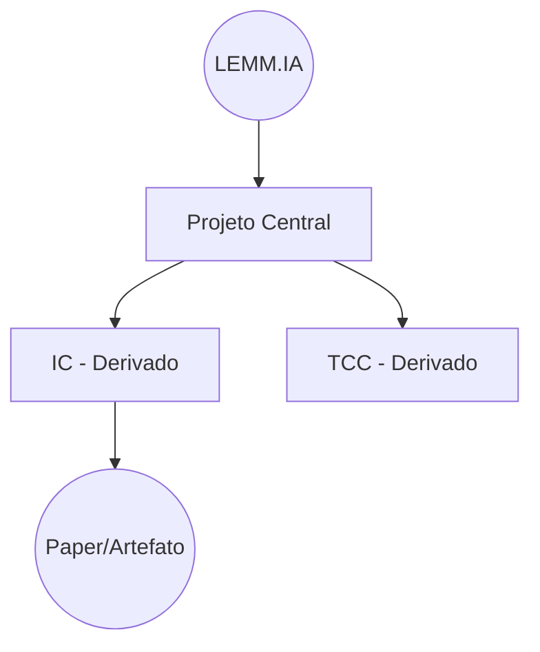

# Documento Mestre do Laboratório — LEMM.IA

> Documento institucional de referência que consolida o contexto, a ideia de nascimento e o plano de desenvolvimento do laboratório para tornar-se referência em Goiás e na comunidade acadêmica regional.

## Controle do documento

> **Versão:** `0.5`
> **Última revisão:** 2026-01-23
> **Responsável documento:** Marcus Vinicius
> **Revisão:** trimestral
> **Contato:** (preencher)
> **Backlog:** (preencher link)
> **Sede digital:** (preencher: Site)
> **GitHub Org:** (preencher link)
> **Hugging Face (Se aplicável):** (preencher link)

### Este documento decide

- Missão/visão e princípios do laboratório.
- Eixos e linhas de pesquisa prioritárias (foco 12 meses).
- Regras mínimas de governança, qualidade e reprodutibilidade.
- Critérios de entrada, execução e release (demo/publicação) de projetos.
- Metas/indicadores e cronograma macro (0–12 meses).

### Este documento não detalha (ver documentos correlatos)

- Portfólio completo e detalhes de cada projeto: [Portfólio do Laboratório](<Portfolio do Laboratorio.md>) e [Lista de Projetos 2025.2 - 2026.1](<Lista de Projetos 2025.2 - 2026.1.md>).
- Plano operacional (12 meses) e workstreams detalhados: [Planos para o Laboratório](<Planos para o Laboratorio.md>).
- Guia de onboarding e templates operacionais: [Onboarding](Onboarding.md).

## Resumo executivo (1 página)

- **LEMM.IA**: laboratório multissetorial de pesquisa aplicada em computação, orientado a entregas e transferência.
- **Operação padrão**: hipótese → baseline reprodutível → métricas → artefatos (paper/demo/dataset).
- **Projetos**: contínuos por linha/repositório; IC/TCC/Pós-Graduação são caminhos possíveis, não condição de entrada.
- **Capacidade inicial**: 1 máquina com 5 GPUs (16GB VRAM cada).
- **Metas (12 meses)**: 1 submissão por projeto (8 projetos atuais) + meta de aceite para todos (podendo ocorrer no ciclo seguinte); sempre que permitido e acordado (incluindo restrições de IP/NDA/parceiro), todo paper aceito com artefatos de reprodutibilidade **adequados ao tipo de projeto** (código + documentação; dados e datasets quando existirem; e, em projetos de ML, pesos/modelos + Model Card quando aplicável); ≥1 PoC; ≥2 demos; one-pager trimestral; participação/destaque em competições técnicas públicas quando fizer sentido. Site é secundário.
- **Governança mínima**: comunicação assíncrona (digital-first), check-in semanal por texto, revisão mensal de portfólio e mentoria por projeto.
- **Entrada de projetos**: alinhamento com eixos prioritários; fora disso, **justificativa formal** para novo eixo = 1 one-pager (problema, impacto, dados, hipótese/métrica, plano de entrega e custo/viabilidade) + issue no backlog; aprovação na revisão mensal de portfólio.
- **Contato**: ver “Controle do documento”.

## 1) Contexto institucional e oportunidade

- **Escopo**: laboratório novo e multissetorial (aeronáutica, agro/clima, logística/otimização, construção civil e finanças).
- **Capacidade atual (baseline)**: 8 trabalhos no ciclo 2025.2–2026.1 e 5 GPUs disponíveis.
- **Oportunidade estratégica**: consolidar um polo regional de pesquisa aplicada em computação (incluindo IA), articulando ensino, pesquisa e extensão, com impacto local e resultados científicos publicáveis.

## 2) Finalidade, missão, visão e princípios

### Finalidade institucional

Estabelecer um núcleo de pesquisa aplicada em computação em Goiás que forme talentos, produza ciência relevante e gere soluções com potencial de transferência para setores estratégicos do Estado de Goiás.

### Missão

Conduzir pesquisa aplicada em computação que gere valor científico e prático, formando talentos, publicando resultados e criando protótipos com potencial de transferência.

### Visão

Ser referência regional em pesquisa aplicada em computação, reconhecida pela excelência científica e pela colaboração com o setor produtivo.

> **Nota de escopo (para evitar interpretação equivocada)**
> O LEMM.IA **não é um laboratório “só de IA”**: IA é uma frente importante, mas não exclusiva; o laboratório é multissetorial e atua conforme os eixos e demandas do portfólio.
> Observação: o “.IA” no nome é parte do branding do laboratório e **não implica IA como requisito em todos os projetos**.

### Princípios institucionais

- Rigor científico e reprodutibilidade como padrão.
- Impacto regional e alinhamento com demandas locais.
- Formação qualificada e ética acadêmica.
- Ciência aberta e colaboração.
- Responsabilidade social, técnica e ambiental.

## 3) Objetivos estratégicos (12–24 meses)

- Estruturar pipeline de experimentos reprodutíveis.
- Formalizar parcerias e pelo menos 1 prova de conceito em andamento.
- Elevar a visibilidade institucional por meio de site, portfólio e eventos.
- Garantir formação com entregas reais (papers, demos, datasets, softwares), públicas quando permitido e acordado.

## 4) Critérios de referência institucional

- **Excelência científica**: publicações consistentes e rigor metodológico.
- **Reprodutibilidade**: padrões de código, dados e experimentos aplicados em todos os projetos.
- **Transferência**: provas de conceito e parcerias com empresas e atores locais.
- **Formação**: alunos capacitados com entregas concretas.
- **Visibilidade**: presença institucional pública contínua (site, one-pager, eventos), sem impedir projetos internos/restritos sob NDA.

Metas (12 meses): ver **14) Metas (12 meses)**.

## 5) Estratégia de implantação e consolidação (pilares)

1. **Foco em linhas prioritárias** com dados e expertise disponíveis.
2. **Esteira de experimentos reprodutíveis** como padrão de operação.
3. **Esteira de publicações** com metas, prazos e drafts por linha.
4. **Transferência contínua** (provas de conceito, parcerias e demos).
5. **Formação estruturada** (onboarding, mentoria e trilhas técnicas).
6. **Comunicação institucional ativa** para credibilidade e atração de parceiros.

## 6) Modelo operacional e fluxo de pesquisa

### Proposição → Hipótese → Experimento → Evidência → Publicação/PoC → Vitrine (pública ou interna)

Diretrizes:

- Todo projeto deve apresentar **hipótese clara**, **baseline reprodutível** e **entrega** (pública quando permitido e acordado; caso contrário, entrega interna/restrita) — ex.: paper, relatório, demo ou dataset.
- Todo experimento deve ter **registro de versões, seed fixa e métricas**.

### 6.1) Gates por etapa (definição de pronto)

| Etapa | Para avançar, precisa existir | Evidência mínima |
|---|---|---|
| Proposição | problema (1 parágrafo); dono do projeto; fonte de dados (ou plano de dados) | nota/issue criada + link de dados |
| Hipótese | Experiment Card rascunho (objetivo/hipótese/dataset/métrica) | card preenchido |
| Experimento | baseline reprodutível; ambiente versionado; logs | comando de reprodução + log salvo |
| Evidência | replicação (≥2 execuções com seed definida) + comparação com baseline | tabela/gráfico + commit hash |
| Publicação/PoC | draft + checklist de reprodutibilidade + avaliação de risco de dados | revisão interna concluída |
| Vitrine | demo (vídeo/GIF) + repo limpo + texto curto de impacto | página do projeto (site/one-pager) |

## 7) Eixos temáticos prioritários e projetos em curso (base do portfólio)

Base documental: [Portfólio do Laboratório](<Portfolio do Laboratorio.md>) e [Lista de Projetos 2025.2 - 2026.1](<Lista de Projetos 2025.2 - 2026.1.md>).

Nota: os eixos abaixo são **setoriais/temáticos** (não “técnicos”). Projetos podem (ou não) usar IA/treinamento em GPU; a infraestrutura (GPU/CPU) é alocada conforme necessidade do projeto.

Regra prática: manter poucos eixos (para não fragmentar o portfólio) e só **dividir** um eixo quando houver massa crítica (ex.: ≥3 projetos ativos) ou governança claramente diferente (dados/entregas/risco/mentor).

| Eixo temático (prioritário) | Foco (1 frase) | Projetos em curso (ciclo 2025.2–2026.1) |
|---|---|---|
| Segurança e risco aeronáutico | Modelagem e análise de sensibilidade para risco/segurança aeronáutica. | 24354 (Andressa); PIAT (RUL) — artigo (material inicial) |
| Agroindústria, clima e agricultura de precisão | Dados climáticos, imputação, gêmeo digital e edge/fog aplicados ao agro. | 24589 (Hitalo); 24616 (Mateus) |
| Logística e otimização | Otimização combinatória e meta-heurísticas aplicadas a problemas logísticos. | 24508 (Enzo) |
| Construção civil e infraestrutura inteligente | Monitoramento, IoT e otimização aplicados à engenharia civil. | 24039 (Arthur); 24434 (Lucas) |
| Finanças quantitativas e mercados digitais | Modelagem de séries temporais, risco e estratégias para mercados financeiros/digitais. | 23716 (Diego); 24382 (Marcus) |

Observação: novos projetos devem ser **alinhados a esses eixos** ou justificar a criação de um novo eixo institucional.
Justificativa formal = 1 one-pager (problema, impacto, dados, hipótese/métrica, plano de entrega e custo/viabilidade) + issue no backlog; aprovação na revisão mensal de portfólio.

Observação: crescimento do portfólio preferencialmente via **forks** (ver **9) Governança e rotinas**).

### 7.1) Linhas de pesquisa (core)

- Definir 2–4 linhas *core* para os próximos 12 meses (e seus líderes/mentores).
- Para cada linha *core*, manter: 1 pergunta-guia, 1 dataset principal (ou instâncias/benchmark/plano de dados) e 1 entrega (paper/demo/relatório).

## 8) Como atuamos

- Pesquisa aplicada por projetos contínuos, orientada a entregas (paper/demo/relatório): IC/TCC/mestrado/doutorado são formatos possíveis, não requisito (também pode ser iniciativa interna, iniciativa independente sem vínculo formal e/ou PoC com parceiros).
- Continuidade por linha e repositório: backlog, código, dados e documentação seguem entre ciclos; pessoas entram/saem sem “reiniciar” o projeto.
- Padrões mínimos de reprodutibilidade e documentação.
- Comunicação e parcerias quando fizer sentido.

## 9) Governança e rotinas

### Papéis (simples)

- Coordenação do laboratório.
- Mentores por projeto.
- Membros (alunos e colaboradores).

### Digital-first (laboratório descentralizado)

- A “sede” do laboratório é digital: discussões e decisões acontecem na **Sede digital** (texto), não no corredor.
- Canais de texto **visíveis a todos os membros por padrão** (dentro da Sede digital), com canais restritos quando houver dados internos/NDA.
- Canais mínimos: 1 canal de anúncios, 1 canal geral e 1 canal por projeto (status, decisões e evidências).
- Toda decisão relevante deve virar registro (mensagem/link) no canal apropriado.

### Modelo de crescimento: laboratório como grafo (forks)

- Projetos são **nós**; conexões (arestas) são dados, código, pessoas e aprendizados compartilhados.

- Novo projeto deve nascer, preferencialmente, de um **fork**: pergunta em aberto, dataset ou baseline já existente no laboratório.
- **Mitose (regra)**: um nó pai só “gera” um nó filho depois de entregar algo concreto (baseline reprodutível ou paper/artefato aceito).
- **Herança**: o nó filho herda padrões (README, reprodução, logs) e reutiliza repos/dados do laboratório sempre que possível.
- **Autonomia**: nó ganha prioridade de GPU quando tem baseline reprodutível e check-in em dia.
- **Sobrevivência**: nós sem check-in por 30 dias são arquivados e perdem prioridade de GPU (podem ser reativados com novo baseline/check-in).

### Rotinas

- Check-in semanal assíncrono (texto): status, bloqueios e próximos passos por projeto.
- Revisão mensal de portfólio (assíncrona): prioridades e ajustes.
- Mentorias 1:1: quando necessário.
- Encontros síncronos: opcionais (quando fizer sentido) e sempre com registro em texto.

### Decisões rápidas (para evitar travas)

- Conflito de prioridade/GPU: coordenação decide.
- Dados internos/restritos: coordenação + mentor do projeto (e responsável pelo dado quando houver).
- Release (público quando permitido e acordado; caso contrário interno/restrito): mentor do projeto + coordenação (e responsável pelo dado quando houver).

## 10) Padrões mínimos de qualidade e reprodutibilidade

- Baseline reprodutível (comando + configuração).
- Seed e logs salvos.
- Versões (bibliotecas/dados) e commit hash.
- README com instruções de reprodução.

## 11) Infraestrutura, dados e segurança

- **Política de GPU**: agenda, prioridades e logs.
- **Código e dados**: classificação (público/interno/restrito), acesso mínimo e versionamento.
- **Backups**: configs, scripts e metadados críticos.
- **Ambiente**: `requirements.txt` / `environment.yml` por projeto.

### 11.1) Classificação do projeto (kickoff)

No início de cada projeto (kickoff), classificar **código e dados**:

- **Público**: pode ir para a vitrine pública (GitHub/Hugging Face quando aplicável).
- **Interno**: somente para membros (sem restrição contratual), com acesso controlado.
- **Restrito (NDA/parceiro)**: acesso mínimo e regras contratuais explícitas.

#### Registro obrigatório

- Registrar a classificação (código e dados) no **README** e no **canal do projeto**, com data e motivo.

#### Obrigatório em todos os casos (inclusive Interno/Restrito)

- **Reprodutibilidade interna**: comando, ambiente, logs, seed e commit hash (ver **10) Padrões mínimos de qualidade e reprodutibilidade**).
- **Evidência mínima**: tabela/gráfico de resultados + versão (commit/dados) usada.

#### Quando Restrito (NDA/parceiro)

- Usar **repositório privado** (na org do lab ou espelho interno) com acesso mínimo.
- A vitrine pública, quando permitida, pode ser apenas **descrição anonimizável + resultados agregados**, sem expor código/dados/artefatos restritos.

### 11.2) Diretrizes para Spin-offs e Propriedade Intelectual (PI)

> Diretriz interna do laboratório. Cada membro é responsável por cumprir contratos/obrigações com terceiros e licenças de dados/código.

#### Padrão open-source (default quando permitido)

- Por padrão, o que for produzido no laboratório é publicado **quando permitido** (código e artefatos), priorizando disseminação científica.
- Licenças sugeridas (simples): **Apache-2.0** (ou **MIT**) para código; datasets e modelos **apenas quando permitido** pela origem/licença dos dados.
- Vitrine primária (pública quando permitido): GitHub Organization (código e documentação) e, quando aplicável, Hugging Face (modelos/datasets de ML); alternativa quando necessário: repositório privado/espelho interno + documentação interna.

#### Caminho para startup (quando houver potencial comercial)

- O “dono do projeto” (maintainer/autor principal, definido no início e registrado) tem preferência para liderar a exploração comercial.
- O laboratório atua como incubadora técnica: mentoria, revisão, padrões e vitrine (sem exigir “sociedade” como regra).
- Modelo recomendado: **open-core** (base aberta + componentes proprietários opcionais), mantendo reprodutibilidade do baseline.

#### Contrapartidas (simples)

- A spin-off deve **citar** a origem no LEMM.IA (paper, README e/ou página do produto).
- Quando aplicável, deve fazer **back-contribution**: melhorias no core open-source (PRs, issues, documentação, benchmarks, ou manutenção).

#### Registro e transparência

- Decisão de licença e caminho (open-only vs open-core) deve ficar registrada no README do projeto e na sede digital (canal do projeto).

## 12) Formação, cultura e responsabilidade científica

Meta: aluno produtivo em 2 semanas e baseline reprodutível em 4 semanas.
Documento detalhado: [Onboarding](Onboarding.md).

Elementos-chave:

- Trilha técnica com módulos (git, dados, GPU, avaliação, escrita).
- Mentoria estruturada e metas quinzenais.
- Cultura de ciência aberta, ética acadêmica e rigor técnico.

## 13) Comunicação institucional e visibilidade

- **Vitrine primária (pública quando permitido)**: GitHub Organization (código e documentação) e, quando aplicável, Hugging Face (modelos/datasets de ML); quando não permitido, manter materiais internos/restritos e/ou vitrine pública com descrições anonimizadas/sem IP.
- **Diretriz (open-by-default, sem travar parcerias)**: sempre que permitido e acordado (IP/NDA/revisão de parceiro), todo paper aceito deve ter artefatos de reprodutibilidade **compatíveis com o tipo de projeto** (código + documentação; dados/datasets quando existirem; e, em projetos de ML, pesos/modelos + Model Card quando aplicável). Preferência por GitHub do lab; alternativa: repo privado/espelho interno.
- **Site do laboratório é secundário** (apontar para a vitrine principal).
- **One-pager** atualizado trimestralmente: [One-pager](../recursos/apresentacao/One-pager%20LEMMIA%202025.2-2026.1.md).
- LinkedIn e eventos: opcionais (amplificação, não “fonte de verdade”).

## 14) Metas (12 meses)

- **Publicações**: 1 submissão por projeto do ciclo 2025.2–2026.1 (8 projetos) e meta de aceite para todos (podendo ocorrer no ciclo seguinte).
- **Transferência**: ≥1 PoC em andamento e ≥2 demos (públicas quando permitido; internas quando necessário).
- **Visibilidade**: manter GitHub Organization ativo como vitrine (pública quando permitido; alternativa interna/privada quando necessário) e usar Hugging Face **quando aplicável** (modelos/datasets de ML); site é secundário.
- **Competições técnicas públicas** (ex.: desafios de dados/IA, CTFs de segurança, challenges de otimização/robótica): participação/destaque quando aplicável, como **benchmark externo** e treino de pipeline (dados → modelagem → validação → submissão → reprodutibilidade), além de visibilidade; **não é requisito** e nunca deve envolver dados sensíveis/restritos. A participação é **individual ou por grupo de membros** e, por padrão, não precisa ser comunicada como iniciativa do laboratório; o LEMM.IA pode apoiar (mentoria, revisão, infraestrutura e organização) **conforme necessidade e capacidade**.

## 15) Cronograma de implantação (0–12 meses)

### 0–30 dias

- Governança mínima, ritos e backlog único.
- Templates (experiment card, weekly update, atas).

### 31–90 dias

- Política de GPU e dados.
- Definição de linhas prioritárias e líderes.
- 3 projetos vitrine com narrativa e demo (públicas quando permitido; internas quando necessário).

### 3–6 meses

- 2 entregas rápidas (demo + relatório técnico/pré-print).
- Primeira versão do site publicada.

### 6–12 meses

- 1 submissão por projeto do ciclo 2025.2–2026.1 (8 projetos) + 1 PoC em andamento.
- Consolidação de linhas com artefatos padrão.

## 16) Riscos, conformidade e integridade

| Categoria | Risco | Mitigação |
|---|---|---|
| Infra | Falha de GPU/PC | Agenda, backups e plano B |
| Dados | Uso indevido de dados sensíveis | Classificação + acesso mínimo |
| Pesquisa | Resultados não reprodutíveis | Checklist + versão + seed |
| Pessoas | Sobrecarga de mentoria | Limites por mentor + ritos |
| Parcerias | Expectativas desalinhadas | Escopo e entregas claras |

## 17) Captação, parcerias e sustentabilidade

- Mapear editais trimestralmente.
- 2 propostas/ano para financiamento.
- Pacotes de PoC (8–12 semanas) com entregas claras.
- PoC (8–12 semanas) — entregáveis mínimos: baseline reprodutível, demo, relatório técnico e proposta de continuidade (alinhando dados/IP/publicação no kickoff).
- Premiações em competições externas (ex.: desafios de dados/IA, CTFs, hackathons), quando houver, por padrão são tratadas como iniciativas pessoais dos membros participantes (individualmente ou em grupo), sem vínculo institucional. Se os membros quiserem **associar** a participação/resultado ao laboratório (ex.: como “time do LEMM.IA”), isso deve ser **combinado previamente** e registrado, respeitando IP/regras da competição e eventuais restrições; caso contrário, o laboratório pode apenas apoiar “nos bastidores”.

## 18) Documentos correlatos

- [README](../README.md)
- [Planos para o Laboratório](<Planos para o Laboratorio.md>)
- [Portfólio do Laboratório](<Portfolio do Laboratorio.md>)
- [Lista de Projetos 2025.2 - 2026.1](<Lista de Projetos 2025.2 - 2026.1.md>)
- [Benchmark de Laboratórios](<Benchmark de Laboratorios.md>)
- [Onboarding](Onboarding.md)

## Glossário e siglas

- **IC**: Iniciação Científica.
- **TCC**: Trabalho de Conclusão de Curso.
- **PoC**: Proof of Concept (Prova de Conceito).
- **RUL**: Remaining Useful Life (vida útil remanescente).
- **DRL**: Deep Reinforcement Learning.
- **PIAT**: Physics-Informed Adaptive Transformer (ver produções no portfólio).
- **Computação em névoa (fog computing)**: processamento distribuído próximo à borda (edge), reduzindo latência e dependência de conectividade.
