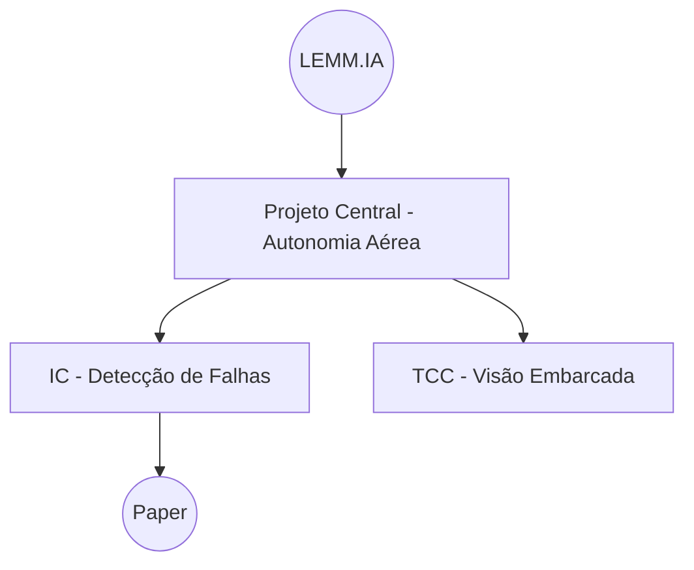

# Plano de atuação inicial — LEMM.IA (12 meses)

## Contexto e premissas (baseline)
- Laboratório novo, sem tema único; portfólio multissetorial (aeronáutico, agroindustrial, logístico).
- Horizonte: 12 meses.
- Equipe atual: 8 trabalhos de IC em andamento (ciclo 2025.2–2026.1).
- Infraestrutura: 1 PC com 5 GPUs de 16GB VRAM.
- Orçamento: ainda não definido.
- Objetivo do 1º ano: concluir ICs/TCCs/mestrados com publicações e iniciar apoio de empresas.
- Vitrine: site do laboratório.

## Missão (refinada)
Conduzir pesquisa aplicada em IA que gere valor científico e prático, formando talentos, publicando resultados e criando protótipos com potencial de transferência para setores estratégicos.

## Visão (refinada)
Ser referência regional em IA aplicada, reconhecida pela excelência científica e pela colaboração com o setor produtivo (aeronáutico, agroindustrial, logístico).

## Resumo executivo (ano 1)
- Foco: consolidar rotinas, padrões e 2–4 linhas principais, gerando entregas publicáveis e uma vitrine externa.
- Estratégia: operar o laboratório como pipeline de experimentos reprodutíveis + pipeline de publicações + prospecção contínua (leve) de parcerias.
- Marcos:
  - 0–30 dias: governança mínima (papéis, cadência, backlog único) e templates (onboarding, weekly update, experiment card).
  - 31–90 dias: infraestrutura/dados operacionais (agenda de GPU, storage, política mínima) e linhas principais definidas com metas e responsáveis.
  - 3–6 meses: 2 quick wins (demo + relatório técnico/pré-print) e 1ª versão do site.
  - 6–12 meses: 3–5 submissões e 1 PoC/parceria em andamento (aceites podem ocorrer no ciclo do ano seguinte).
- Definição de sucesso: ver seções **Indicadores (12 meses)** e **Acompanhamento**.

## Guia de alinhamento (uso interno)
- Cada projeto deve explicitar impacto científico (paper, dataset, método) e/ou aplicação prática (PoC, parceria).
- Priorizar temas que reforcem a conexão com setores produtivos locais.
- Decisões de portfólio devem equilibrar formação de talentos e impacto externo.

## Frentes de atuação (programas do lab)
- Pesquisa aplicada: trilhas por desafio/tema com ICs, TCCs e mestrados. Priorizar 2–4 linhas principais com expertise e dados disponíveis para gerar quick wins no 1º ano, mantendo um espaço controlado para exploratórios e PoCs com empresas quando surgirem oportunidades.
- Publicação e qualidade: padrões de reprodutibilidade, leitura crítica e metas de submissão. Implementar checklist mínimo (seed fixa, registro de hiperparâmetros, versões de bibliotecas/hardware, dataset com metadados claros). Incentivar ciência aberta (código e detalhes de execução). Estabelecer meta de submissão por aluno (ex.: 1 paper/mestrando no ano) e pipeline de publicações com mapeamento de venues e prazos.
- Transferência e parcerias: prospecção ativa com empresas e outros atores. Conectar projetos com aplicação clara a dores do setor e propor PoCs com entregas objetivas. Manter agilidade de resposta sem abrir mão do rigor científico, alinhando expectativas de prazos, IP e publicações.
- Infraestrutura e dados: governança do uso de GPU, agenda de execuções e repositório central de dados com versão e documentação.
- Formação e comunidade: trilha técnica, mentorias regulares e construção de cultura de laboratório.

## Plano de execução e implementação (detalhado)
Este plano está organizado por workstreams (frentes operacionais). Cada frente tem entregáveis com prazo, dono (papel) e evidências mínimas.

### Workstreams (frentes operacionais)
- Governança & Operações: rituais, decisões, backlog único, políticas mínimas e documentação.
- Programas de Pesquisa: linhas principais, metas, backlog técnico por projeto, entregas publicáveis.
- Engenharia & Reprodutibilidade: padrões de repo, reprodutibilidade, avaliação e tracking de experimentos.
- Infraestrutura & Dados: GPU, storage, acesso, backups, dados sensíveis e integridade.
- Pessoas & Formação: onboarding, trilha de capacitação, mentorias e acompanhamento.
- Parcerias & Comunicação: vitrine (site), relacionamento com empresas, eventos e materiais.

### Plano 0–90 dias (MVP operacional)
| Janela | Entregável | Dono (papel) | Evidência/critério de aceite |
|---|---|---|---|
| 0–2 semanas | Calendário oficial e rituais definidos (semanal/quinzenal/mensal) | Coordenação | Agenda publicada + template de ata/weekly update |
| 0–2 semanas | Backlog único do laboratório (projetos + operações) | Coordenação | Board (Trello/Notion/GitHub Projects) com status e responsáveis |
| 0–4 semanas | Intake de projeto (como entra, como é priorizado) | Coordenação + Líderes de linha | 1 checklist + 1 reunião quinzenal de portfólio em funcionamento |
| 0–4 semanas | Padrão mínimo de repositório e DoD de experimento | Líderes de linha + Mentores | Template de repo + checklist de reprodutibilidade adotado em 1 projeto |
| 0–6 semanas | Política mínima de dados (classificação + acesso + versionamento) | Dono do dado + Coordenação | Regra de acesso definida + README padrão para datasets |
| 0–6 semanas | Política mínima de GPU (agendamento + logs + prioridades) | Admin de infra + Coordenação | Agenda/planilha + procedimento de job card |
| 0–8 semanas | Definição de 2–4 linhas principais e seus líderes | Coordenação | Nota por linha com objetivo, critérios e projetos associados |
| 0–8 semanas | Seleção de 3 projetos vitrine (com narrativa + demo) | Coordenação + Comunicação | Página do site/README + 1 demo (vídeo/GIF) |
| 0–12 semanas | Pipeline de publicação (mapa de venues + prazos + drafts) | Líderes de linha | Lista de submissões alvo + 1 draft em progresso por linha |
| 0–12 semanas | Rotina de acompanhamento (KPIs + riscos) | Coordenação | Dashboard simples (mensal) + revisão trimestral agendada |

### Plano 3–12 meses (consolidação)
- Consolidar 2–4 linhas principais com “artefatos padrão” por projeto: baseline reprodutível, experiment card, data card, plano de paper, demo/relatório.
- Evoluir a vitrine (site) com projetos, equipe, publicações, parcerias e materiais (one-pager atualizado a cada trimestre).
- Formalizar parcerias: pelo menos 1 PoC em andamento com entregas e alinhamento de IP/publicação.

## Equilíbrio de portfólio (regra 70-20-10)
- 70% em linhas core (publicações e resultados consistentes).
- 20% em projetos adjacentes (extensões aplicadas, validação em novos dados).
- 10% em exploratórios (alto risco/alto ganho).

## Padrões de publicação e reprodutibilidade (detalhamento)
- Reprodutibilidade obrigatória: seeds fixas, logging de hiperparâmetros, versionamento de código, data card e environment (pip/conda).
- Transparência: sempre documentar dados, licenças, pré-processamento e métricas.
- Journal club interno mensal para leitura crítica.
- Backtracking por prazo: mapear conferências/periódicos e datas limite para planejar cronogramas.
- Ferramentas de apoio: board de acompanhamento (Trello/Asana/Notion) e escrita colaborativa (Overleaf/Google Docs).

### Artefatos padrão por projeto (mínimo)
- Experiment Card (1 página): objetivo, hipótese, dataset(s), métrica(s), baseline, variações planejadas, resultados, conclusão, próximos passos e links (repo/issue/log).
- Data Card (por dataset): origem, licença, coleta, período, schema, splits, pré-processamento, riscos (LGPD/dados sensíveis), acesso/retenção, checksum/versão e referência/citação (inspirado em “Datasheets for Datasets”).
- Model Card (por modelo treinado): uso pretendido, limites, dados de treino/validação, métricas (incluindo recortes), riscos (vieses/privacidade/segurança), requisitos de ambiente/hardware e link de reprodução (inspirado em “Model Cards”).
- Script de reprodução: 1 comando para (a) preparar dados (quando possível), (b) treinar baseline, (c) gerar métricas/figuras principais.
- Registro de versões: commit hash + versão do dataset + environment (`requirements.txt`/`environment.yml`) + seed.

## Transferência e parcerias (detalhamento)
- Prospecção ativa: lista de empresas locais e atores públicos por setor; contatos introdutórios no 1º semestre.
- Pitch do lab: apresentar competências, ativos (dados/código) e casos de uso, mesmo que protótipos internos.
- PoCs com empresas: definir problema, prazo curto, entregas e responsáveis; formalizar alinhamento de IP/publicação.
- Eventos setoriais: meetup ou demo day para visibilidade e aproximação com empresas.
- Indicadores: contatos ativos, acordos em negociação/assinados, PoCs iniciados e concluídos.

## Formação e comunidade (detalhamento)
- Trilha de capacitação interna: seminários técnicos mensais, grupos de estudo e mini-cursos de ferramentas.
- Mentoria estruturada: 1:1 quinzenal ou mensal com pauta pré-enviada pelo aluno.
- Identidade do lab: momentos de compartilhamento nas reuniões gerais (paper/dica/icebreaker).
- Objetivos coletivos: evento interno, repositório open-source ou demo day.
- Planos de Desenvolvimento Individual (IDP): metas de aprendizado e carreira definidas no início e revisadas periodicamente.

## Processo de onboarding (resumo operacional)
- Meta: em 2 semanas aluno produtivo; em 4 semanas baseline reprodutível do projeto.
- Papéis: coordenador, líder de linha, mentor direto, admin de infra e dono do dado (quando houver).
- Fluxo:
  - Pre-entrada (T-7 a T-1): ticket com nome, nível, mentor, projeto, demanda de GPU, dados e termos (LGPD/NDA).
  - Dia 1: boas-vindas, regras do lab, setup de ferramentas, "PR 0" com checklist pessoal.
  - Semana 1: ambiente pronto, experimento exemplo rodando, README inicial e PR mergeado.
  - Semanas 2–4: baseline reprodutível, Experiment Card e plano de testes do mês.
- Checkpoints: A (fim da semana 1), B (fim da semana 2), C (fim da semana 4) com correção de bloqueios.
- Checklist de acessos: comunicação, repositórios, GPU, storage, tracker, dados sensíveis e segredos.
- Padrões mínimos: estrutura de repo, DoD de experimento, PR obrigatório, dados fora do git, política de GPU.
- Trilha inicial: módulos 0–6 (operação, git, ambiente, GPU, dados, avaliação, escrita), ajustada por nível.
- Kit recomendado: `lab-handbook/` com ONBOARDING.md, GPU_POLICY.md, DATA_POLICY.md, REPRO_CHECKLIST.md, PROJECT_TEMPLATE/ e templates.
- Documento detalhado: [Onboarding](Onboarding.md)

## Portfólio e priorização
Base: [Portfólio do Laboratório](<Portfolio do Laboratorio.md>) e [Lista de Projetos 2025.2 - 2026.1](<Lista de Projetos 2025.2 - 2026.1.md>).

Classificar projetos por critérios simples:
- Relevância setorial (aeronáutico, agroindustrial, logístico).
- Potencial de paper.
- Viabilidade com a infraestrutura atual.
- Potencial de parceria externa.

Categorias:
- Exploratório: rápido, prova de viabilidade.
- Linha principal: foco em paper e resultados robustos.
- Transferência: PoC com empresa ou aplicação clara.

### Detalhamento das categorias
- Exploratório: testes rápidos (2–3 meses) para validar técnica ou ideia. Alto risco, baixo custo. Pode virar linha principal se gerar sinal forte.
- Linha principal: projetos core (6–12 meses) com hipóteses claras, método robusto e foco em publicação. Poucos e profundos para garantir qualidade.
- Transferência: PoCs e aplicações orientadas a parceiros. Valor prático e vitrine; buscar extrair aprendizado publicável quando possível.

### Guidelines de balanceamento
- Manter equilíbrio entre ciência e aplicação: 2–3 linhas principais, alguns exploratórios por semestre e 1–2 transferências ativas.
- Todo projeto deve ter responsável interno definido e, quando houver, colaborador externo.
- Reunião quinzenal de portfólio para revisar status, riscos, pivots e oportunidades.

### Matriz de priorização (processo simples)
- Pontuar cada critério de 1 a 5 e somar (ou aplicar peso).
- Peso sugerido (ajuste conforme contexto):
  - Relevância setorial: 30%
  - Potencial de publicação: 30%
  - Viabilidade técnica: 25%
  - Potencial de parceria externa: 15%
- Classificar por faixa:
  - 4.0 a 5.0: prioridade alta (linha principal).
  - 3.0 a 3.9: prioridade média (adjacente/exploratório).
  - < 3.0: manter no backlog ou esperar recursos.
- Revisão trimestral para atualizar scores e reequilibrar o portfólio.

### Template de avaliação por projeto
- Título:
- Setor:
- Status:
- Scores (1–5): relevância setorial, potencial de publicação, viabilidade técnica, potencial de parceria.
- Nota final (com peso):
- Decisão: linha principal / exploratório / transferência / backlog.

## Modelo de organização em grafo (proposta)
Ideia base: núcleo (LEMM.IA) como centro, conectado a projetos centrais (linhas principais), que por sua vez conectam projetos individuais (IC, TCC, mestrado). Esse formato escala bem e permite visão de portfólio e derivações.

### Tipos de nós
- Núcleo: LEMM.IA (governança e padrões).
- Projeto central: linha principal, liderada por professor/mestrado/doutorado.
- Projeto individual: IC/TCC/mestrado derivado de um projeto central ou de outro individual.
- Ativo/resultado: paper, dataset, código, PoC (saídas do projeto).

### Relações (arestas)
- deriva_de: projeto individual aponta para um projeto central ou individual pai.
- compartilha_com: dados, código ou infraestrutura comum.
- depende_de: pré-requisito técnico.
- entrega: link para paper, dataset ou PoC.

### Regras simples para manter escalável
- Todo projeto individual deve ter um pai e uma entrega esperada.
- Profundidade máxima sugerida: 3–4 níveis.
- Projetos centrais devem ter dono (responsável), objetivo e critério de sucesso.
- Revisão trimestral para consolidar, fundir ou encerrar nós fracos.

### Template mínimo por nó (campos)
- Título, tipo, setor, objetivo, método, responsável, status, início/fim, entregas, dependências.

### Exemplo simples (mermaid)

## Governança e rotina
### Papéis (mínimo)
- Coordenação geral do laboratório.
- Líderes de linha por tema ou método.
- Mentores diretos por projeto.
- Admin de infraestrutura (GPU/storage).
- Dono do dado (quando houver dataset interno/parceiro).
- Ponto focal de comunicação (site/mídias).

### Rituais (cadência sugerida)
- Reunião semanal do lab (60 min): status por projeto + bloqueios + próximos experimentos; registrar ata curta.
- Reunião quinzenal de portfólio (90 min): priorização, riscos, pivots, oportunidades e alocação de GPU.
- Mentoria 1:1 (quinzenal): alinhamento técnico, metas da quinzena e acompanhamento de escrita.
- Journal club (mensal): leitura crítica e alinhamento de padrões de publicação.
- Revisão trimestral (2h): KPIs, revisão de riscos, reequilíbrio do portfólio (70-20-10) e plano do próximo trimestre.

### Matriz RACI (decisões típicas)
| Decisão | R (executa) | A (aprova) | C (consulta) | I (informa) |
|---|---|---|---|---|
| Aceitar/encerrar projeto | Líder de linha | Coordenação | Mentores | Lab |
| Prioridade de GPU / janelas longas | Admin de infra | Coordenação | Líderes de linha | Lab |
| Acesso a dados sensíveis | Dono do dado | Coordenação | Mentor + Instituição (se houver) | Lab |
| Submissão de paper | Autor(es) | Líder de linha | Coordenação | Lab |
| Parceria/NDA/PoC | Coordenação | Coordenação | Líder de linha + Instituição | Lab |
| Publicar código/dados abertos | Autor(es) | Coordenação | Dono do dado + Instituição | Lab |

## Indicadores (12 meses)
- Formação (conclusões): 100% das ICs/TCCs previstas e pelo menos 1 mestrado concluído; cada trabalho com artefato (paper, protótipo ou dataset).
- Publicações: 3–5 submissões no ano 1 e 1–2 aceites (podendo ocorrer no ano seguinte); contabilizar re-submissões como parte do ciclo.
- Parcerias: pelo menos 3 empresas com contato ativo e 1 projeto piloto/PoC em andamento; registrar visitas e apresentações realizadas.
- PoCs/Demos: 1 PoC interno por linha principal e PoCs com parceiros quando houver; manter demos utilizáveis na vitrine do site.
- Captação: mínimo de 2 propostas submetidas (editais, convênios, doações) e acompanhamento de resultados.
- Visibilidade: site publicado (sim/não) e presença em eventos ou mídia local.

## Acompanhamento
- Revisão mensal (operacional): status do backlog, utilização de GPU, bloqueios e ações corretivas.
- Revisão trimestral (estratégica): KPIs, riscos, reequilíbrio do portfólio e ajuste do roadmap.
- Relatório semestral e anual: resultados, aprendizados, lista de entregas e próximos passos.

## Gestão de riscos e compliance (mínimo)
### Registro de riscos (exemplo)
| Categoria | Risco | Prob. | Impacto | Mitigação | Dono |
|---|---|---:|---:|---|---|
| Infra | Falha de GPU/PC e indisponibilidade | M | A | UPS + backup de configs + priorização + plano B (cloud/CPU) | Admin de infra |
| Dados | Uso de dados sensíveis sem controle | B | A | Classificação + acesso mínimo + termo LGPD/NDA + logs | Dono do dado |
| Pesquisa | Resultados não reprodutíveis | M | A | Checklist + versionamento + seeds + revisão interna | Líder de linha |
| Pessoas | Sobrecarga de mentorias | M | M | Limites por mentor + rituais + triagem de backlog | Coordenação |
| Parceria | Expectativas desalinhadas (IP/prazos) | M | A | Termo de escopo + entregas + janela de publicação | Coordenação |

### Checklist de compliance (mínimo)
- Dados: identificar se há dados pessoais/sensíveis; se sim, registrar base legal, acesso, retenção e consentimentos (quando aplicável).
- Segurança: segredos fora de repositórios; permissões por projeto; backups mínimos do que é crítico.
- Publicação/IP: acordar previamente o que pode ser publicado e o que precisa de revisão institucional/parceiro.

### Responsible AI e risco (mínimo, quando houver modelos)
- Aplicar um ciclo leve inspirado no NIST AI RMF (Govern/Map/Measure/Manage) para projetos com potencial de uso externo.
- Documentar uso pretendido, limitações e trade-offs; registrar riscos e mitigação (inclusive privacidade, vieses e segurança).
- Medir desempenho com recortes relevantes (quando aplicável) e registrar protocolo de avaliação (splits, seeds, métricas).
- Garantir rastreabilidade: data card + model card + link de reprodução + decisões registradas (ata/issue).

## Orçamento, compras e captação
- CapEx (infra): upgrades de storage, UPS, rede; plano de manutenção preventiva.
- OpEx (operação): domínio/hosting do site, ferramentas (se houver), custos de eventos/viagens, taxas de publicação.
- Captação: mapear editais (trimestral), preparar 2 propostas/ano e manter pipeline de prospecção com 10–20 leads.
- Parcerias: padronizar “pacotes” de PoC (8–12 semanas) com escopo, entregas, responsáveis e critérios de sucesso.

## Visibilidade e comunicação externa (plano)
- Objetivo: aumentar credibilidade, atrair parceiros e talentos, e gerar demanda para PoCs.
- Canais base: site do lab (vitrine), LinkedIn institucional, eventos locais, newsletter simples (opcional).
- Conteúdos-chave: destaques de projetos, demos, submissão/aceite de papers, perfis de alunos, parcerias.
- Cadência sugerida: 1 post/mês, 1 update trimestral de portfólio, 1 evento/semestre.
- Responsável: designar um ponto focal de comunicação e um revisor técnico.

## Quick wins de visibilidade (0–90 dias)
- Publicar site com missão/visão, frentes, equipe e 3 projetos vitrine.
- Selecionar 3 projetos vitrine com base no [Portfólio do Laboratório](<Portfolio do Laboratorio.md>) (sugestão: Andressa + Hitalo + Enzo).
- One-pager do lab (MD): [One-pager LEMMIA 2025.2-2026.1.md](<../recursos/apresentacao/One-pager LEMMIA 2025.2-2026.1.md>)
- Fazer 1 demo funcional para o site (vídeo curto ou GIF).
- Submeter talk em evento local ou organizar meetup simples.
- Abrir 1 repositório open-source com template do lab ou baseline.

## Entregáveis do primeiro ano
- Documento anual de portfólio.
- Repositório padrão com pipelines de experimentos.
- Relatório semestral de resultados.
- Vitrine de projetos (site).
- Evento interno ou demo day.

## Ferramentas e stack (MVP)
- Gestão (backlog): Trello/Notion/GitHub Projects (um único board com projetos + operações).
- Código: GitHub/GitLab + PR obrigatório + issues por experimento.
- Experimentos: logs padronizados + (opcional) MLflow/W&B quando fizer sentido.
- Documentação: README por projeto + notas no Obsidian (decisões, atas, templates).
- Comunicação: canal oficial + calendário + templates (weekly update, ata, experiment card).

## Infraestrutura e dados (diretrizes iniciais)
- Reserva de GPU por projeto e controle de filas.
- Checklist de reprodutibilidade (seed, dados, ambiente).
- Código versionado e documentação mínima.

## Infraestrutura e dados (detalhamento)
- Governança de GPU: agenda de uso por projeto, janelas por aluno e monitoramento simples (ex.: logs do nvidia-smi).
- Repositório de dados: pasta central com versionamento, controle de acesso e README por dataset (origem, formato, split) alinhado a princípios FAIR quando aplicável.
- Privacidade: dados sensíveis devem ter armazenamento seguro e regras claras de compartilhamento.
- Backups: ao menos backup de configs, scripts e metadados; definir periodicidade e responsável.
- Classificação de dados: público / interno / restrito (parceiro/LGPD) com regras de acesso e retenção.
- Ambiente controlado: uso de ambientes virtuais ou containers com versões fixas de bibliotecas e hardware registrado.
- Integridade: checksum dos datasets e registro de versões para reprodutibilidade.

## Roadmap macro (trimestres)

### T1 (meses 1–3)
- Catalogar projetos existentes e classificar no portfólio.
- Definir padrões de código, dados e publicação.
- Planejar site do laboratório (estrutura e conteúdo).

### T2 (meses 4–6)
- Estabilizar 2–4 linhas principais com metas de paper.
- Publicar primeira versão do site (vitrine).
- Iniciar prospecção ativa de empresas.

### T3 (meses 7–9)
- Consolidar resultados de IC/TCC/mestrado.
- Submeter papers e preparar PoCs.
- Estruturar pitch/relatório para parceiros.

### T4 (meses 10–12)
- Fechar ciclo de publicações e conclusões.
- Rodar demo day/mostra.
- Planejar portfólio e captação para o ano 2.

## Referências e leituras recomendadas
- Exemplos de handbooks/políticas de outros laboratórios: [Benchmark de Laboratórios](<Benchmark de Laboratorios.md>)
### Reprodutibilidade e engenharia científica
- [The Turing Way](https://book.the-turing-way.org/)
- [Good enough practices in scientific computing (PLOS)](https://journals.plos.org/ploscompbiol/article?id=10.1371/journal.pcbi.1005510)
- [Ten Simple Rules for Reproducible Computational Research (PLOS)](https://journals.plos.org/ploscompbiol/article?id=10.1371/journal.pcbi.1003285)
- [Hidden Technical Debt in Machine Learning Systems (NeurIPS)](https://papers.nips.cc/paper_files/paper/2015/hash/86df7dcfd896fcaf2674f757a2463eba-Abstract.html)

### Dados (FAIR) e documentação
- [FAIR Principles (GO FAIR)](https://www.go-fair.org/fair-principles/)
- [The FAIR Guiding Principles for scientific data management and stewardship (doi)](https://doi.org/10.1038/sdata.2016.18)
- [Datasheets for Datasets (arXiv)](https://arxiv.org/abs/1803.09010)
- [Model Cards for Model Reporting (arXiv)](https://arxiv.org/abs/1810.03993)
- [Citation File Format (CFF)](https://citation-file-format.github.io/)

### Responsible AI e risco
- [AI Risk Management Framework (NIST)](https://www.nist.gov/itl/ai-risk-management-framework)
- [NIST AI RMF 1.0 (PDF)](https://nvlpubs.nist.gov/nistpubs/ai/NIST.AI.100-1.pdf)

### Compliance (Brasil)
- [LGPD — Lei 13.709/2018 (Planalto)](http://www.planalto.gov.br/ccivil_03/_ato2015-2018/2018/lei/L13709.htm)
- [ANPD — Agência Nacional de Proteção de Dados](https://www.gov.br/anpd/pt-br)

### Ferramentas e templates (opcional)
- [Cookiecutter Data Science](https://drivendata.github.io/cookiecutter-data-science/)
- [DVC (Data Version Control)](https://doc.dvc.org/)
- [Git Large File Storage (LFS)](https://git-lfs.com/)

## Pendências e dados que preciso
- Lista dos projetos atuais (título, área, status, dados, orientador, meta de paper).
- Quem assume a coordenação geral e líderes de linha.
- Lista de potenciais parceiros/empresas.
- Preferências para o site (seções, língua, domínio).
