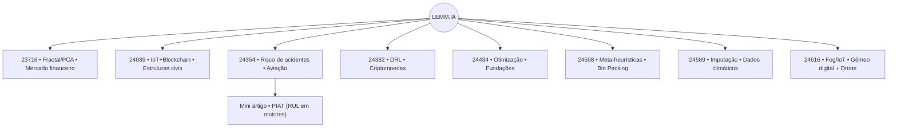

# Portfólio do Laboratório — LEMM.IA

Fonte: PDFs em `10_Projects/Projetos/` (organizado por subpastas; atualizado em 13/01/2026).

Ver também:
- [Lista de Projetos 2025.2 - 2026.1](<Lista de Projetos 2025.2 - 2026.1.md>)

## Resumo
- Produções adicionais (PDF): 1
- Orientação: Maria Jose Pereira Dantas
- Planos de trabalho: 8
- Projeto de pesquisa predominante (7/8): Tecnologias disruptivas para a modelagem de cadeias de suprimentos agroindustriais sustentáveis, rastreáveis e verdes, no Centro Oeste do Brasil
- Grupo de pesquisa predominante (7/8): Identificação, Modelagem e Inteligência Artificial para Otimização de Sistemas (Identification, Modeling and Artificial Intelligence for Systems Optimization)

## Mapa (alto nível)

## Projetos por setor

### Aeronáutico

#### 24354 — Andressa Ferreira da Silva
- Plano: Otimização de modelos preditivos para risco de acidentes aéreos: calibração e análise de sensibilidade integrada a variáveis climáticas
- Palavras-chave: Otimização, Predição, Aviação
- Objetivo geral: Desenvolver um modelo integrado de análise de risco aeronáutico, combinando técnicas estatísticas multivariadas e processos de otimização, para avaliar e prever a probabilidade de ocorrência de acidentes aéreos com base na interação dinâmica entre múltiplos fatores operacionais, considerando variáveis climáticas como um componente complementar do sistema.
- Período (cronograma): 09/2025 → 08/2026
- PDF: [24354_andressa.pdf](../10_Projects/Projetos/planos/24354_andressa.pdf)

### Construção Civil

#### 24039 — Arthur Gomes Lima
- Plano: Monitoramento estrutural com IoT e blockchain para rastreabilidade de dados em estruturas civis
- Palavras-chave: Monitoramento estrutural, Internet das Coisas, Blockchain
- Objetivo geral: Desenvolver um sistema de monitoramento estrutural de estruturas civis utilizando sensores IoT e tecnologia blockchain, com interface web para visualização remota dos dados, garantindo a integridade, rastreabilidade e segurança das informações coletadas.
- Período (cronograma): 09/2025 → 06/2026
- PDF: [24039_arthur.pdf](../10_Projects/Projetos/planos/24039_arthur.pdf)

#### 24434 — Lucas Teixeira Correia
- Plano: Otimização do dimensionamento e posicionamento de fundações superficiais de edifícios considerando conceitos de empacotamento e mecânica das estruturas
- Palavras-chave: Otimização; Automação em engenharia civil; Metaheurística
- Objetivo geral: Desenvolver um software para o dimensionamento otimizado e o posicionamento de fundações de concreto armado em grandes edificações, incorporando conceitos de empacotamento e técnicas de otimização.
- Período (cronograma): 09/2025 → 08/2026
- PDF: [24434_lucas.pdf](../10_Projects/Projetos/planos/24434_lucas.pdf)

### Logística/Otimização

#### 24508 — Enzo Moura de Rezende
- Plano: Meta-heurísticas para o problema de Bin Packing: comparação, construção e identificação da melhor abordagem
- Palavras-chave: Meta-heurística, Bin Packing
- Objetivo geral: Identificar as meta-heurísticas mais eficientes para a obtenção de melhores resultados na resolução do problema Bin Packing.
- Período (cronograma): 09/2025 → 08/2026
- PDF: [24508_enzo.pdf](../10_Projects/Projetos/planos/24508_enzo.pdf)

### Clima

#### 24589 — Hitalo Augusto Lourenco Guedes
- Plano: Aprimorando a imputação de dados climáticos: um novo método baseado em algoritmos de machine learning
- Palavras-chave: random forest, Climate, Missing Data
- Objetivo geral: Este trabalho tem como objetivo geral desenvolver e implementar um modelo de imputação dos dados, aplicando algoritmos de machine learning a fim de mitigar os problemas de dados faltantes.
- Período (cronograma): 09/2025 → 08/2026
- PDF: [24589_Hitalo.pdf](../10_Projects/Projetos/planos/24589_Hitalo.pdf)

### Agro

#### 24616 — Mateus Neumann Amorim Marchetti
- Plano: Aplicação da computação em névoa para o aperfeiçoamento e conexão de um gêmeo digital a um drone dedicado a monitoramento de lavouras
- Projeto de pesquisa: Desempenho de gêmeo digital aplicado na agricultura de precisão
- Palavras-chave: Computação em névoa, Gêmeo Digital e agricultura de precisão
- Objetivo geral: Aperfeiçoar o funcionamento e aplicabilidade do gêmeo digital do drone visando aplicação em lavoura sob condições de ambiente extremamente desfavoráveis (sol intenso, raios UV, chuvas ácidas, calor e frio). O aperfeiçoamento será por meio da computação em névoa, atrelada ao uso de redes neurais.
- Período (cronograma): 09/2025 → 08/2026
- PDF: [24616_mateus.pdf](../10_Projects/Projetos/planos/24616_mateus.pdf)
- Backup (HTML): [24616_mateus.html](../10_Projects/Projetos/backups/24616_mateus.html)

### Finanças

#### 23716 — Diego da Silva Veloso de Faria
- Plano: Aplicação de modelagem fractal para predição de tendências em um sistema de negociação de ativos do mercado financeiro
- Palavras-chave: Fractal, Cluster, PCA
- Objetivo geral: Usar modelagem estocástica com base no parâmetro de Hurst e técnicas de análise multivariada para predizer o sinal de negociação (venda, compra, ou nenhuma ação) de ativos financeiros.
- Período (cronograma): 09/2025 → 08/2026
- PDF: [23716_Diego.pdf](../10_Projects/Projetos/planos/23716_Diego.pdf)

#### 24382 — Marcus Vinicius Santos da Silva
- Plano: Agentes de Deep Reinforcement Learning no mercado de criptomoedas
- Palavras-chave: Deep Reinforcement Learning (DRL), Criptomoedas, LSTM, GRU, Análise de Sentimento
- Objetivo geral: Desenvolver um agente baseado em Deep Reinforcement Learning, integrando análise de sentimento em redes sociais, utilizando modelos pré-treinados e indicadores provenientes de um método ensemble que combina LSTM e GRU, de forma a realizar operações de trading e holding de criptomoedas, avaliando por Lucro líquido, Sharpe Ratio e outras métricas.
- Período (cronograma): 09/2025 → 08/2026
- PDF: [24382_Marcus.pdf](../10_Projects/Projetos/planos/24382_Marcus.pdf)

## Produções

### Mini artigo — Andressa Ferreira da Silva
- Título: PIAT: Physics-Informed Adaptive Transformer para Previsão de RUL em Motores Aeronáuticos
- Index Terms: RUL, Deep Learning, Physics-Informed Machine Learning, Transformer, Motores Aeronáuticos.
- PDF: [Mini_Artigo_Andressa.pdf](../10_Projects/Projetos/producoes/Mini_Artigo_Andressa.pdf)
